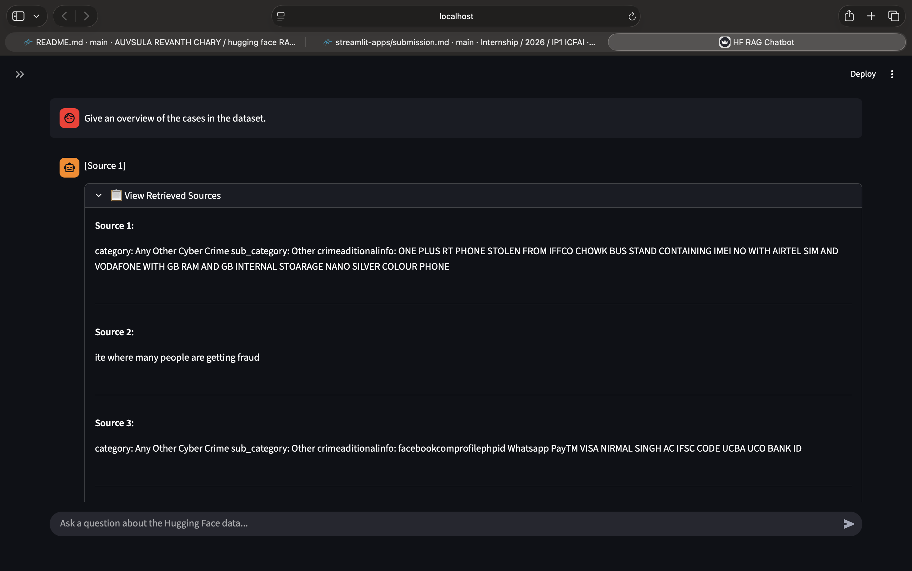

Hugging Face RAG Chatbot

A Retrieval-Augmented Generation (RAG) chatbot built using Streamlit, Hugging Face Datasets, Sentence Transformers, FAISS, and Transformer-based Large Language Models.

The application retrieves semantically relevant information from a knowledge base and uses the retrieved context to generate accurate, grounded responses instead of relying solely on the language model.

⸻

Overview

This project implements a complete Retrieval-Augmented Generation (RAG) pipeline.

The workflow consists of:

1. Loading a Hugging Face dataset as the knowledge source.
2. Transforming the dataset into searchable text chunks.
3. Generating semantic embeddings for every chunk.
4. Indexing the embeddings using FAISS.
5. Retrieving the most relevant chunks for each user query.
6. Constructing a context-aware prompt.
7. Generating an answer using a Large Language Model.
8. Displaying the retrieved sources for transparency.

Unlike a conventional chatbot, responses are generated from retrieved evidence, significantly reducing hallucinations and improving factual consistency.

⸻

Features

* Retrieval-Augmented Generation (RAG)
* Hugging Face Dataset integration
* Semantic similarity search
* FAISS vector database
* Sentence Transformer embeddings
* Streamlit chat interface
* Conversation history
* Expandable retrieved source viewer
* Context deduplication
* Prompt engineering improvements
* Fast local inference
* Clean dark-themed interface

⸻

Architecture
```
 User Query
     │
     ▼
 Embed User Query
     │
     ▼
 FAISS Similarity Search
     │
     ▼
 Retrieve Top-K Chunks
     │
     ▼
 Remove Duplicate Contexts
     │
     ▼
 Construct Prompt
     │
     ▼
 Large Language Model
     │
     ▼
 Generated Response
     │
     ▼
 Display Retrieved Sources
```
⸻

Project Structure
```text
hugging-face-rag-chatbot/
│
├── app.py
├── requirements.txt
├── README.md
│
├── data/
│   └── your_document.pdf
│
├── utils/
│   ├── loader.py
│   ├── embedder.py
│   └── retriever.py
│
└── screenshots/
    └── demo.png
```
⸻

Knowledge Source

The chatbot uses a Hugging Face dataset containing cybercrime complaint records as its knowledge base.

Each record includes structured information such as:

* Crime category
* Sub-category
* Complaint description
* Additional information

The dataset is transformed into semantic chunks before indexing to support efficient retrieval.

⸻

Chunking Strategy

Each dataset record is converted into a structured text representation before embedding.

Example:

Category: Any Other Cyber Crime

Sub Category: Other Crime

Additional Information:
OnePlus phone stolen from IFFCO Chowk Bus Stand...

Each complaint is treated as an individual semantic chunk.

This approach preserves the contextual relationship between fields while enabling efficient retrieval.

⸻

Embedding Model

Embeddings are generated using the Sentence Transformers library.

Recommended model:
```
all-MiniLM-L6-v2
```
Reasons for choosing this model:

* Lightweight
* Fast inference
* Strong semantic understanding
* High retrieval quality
* Low memory consumption

⸻

Vector Store

The project uses FAISS (Facebook AI Similarity Search) for vector indexing.

FAISS enables efficient nearest-neighbor search over thousands of embedded documents and provides low-latency semantic retrieval.

⸻

Retrieval Pipeline

For every user query, the application performs the following steps:

1. Generate an embedding for the query.
2. Perform similarity search using FAISS.
3. Retrieve the Top-K most relevant chunks.
4. Remove duplicate and near-duplicate contexts.
5. Build a structured prompt.
6. Send the prompt to the language model.
7. Generate a grounded response.
8. Display the retrieved sources alongside the answer.

⸻

Recent Improvements

The retrieval and response generation pipeline has been refined to improve response quality and user experience.

Context Deduplication

A deduplication step removes duplicate and highly similar retrieved chunks before prompt construction.

Benefits:

* Eliminates repetitive context
* Improves prompt quality
* Produces more concise answers

⸻

Prompt Engineering

Retrieved contexts are formatted as individual sources.

Example:
```
[Source 1]
...
[Source 2]
...
```
This structure improves context separation and helps the language model better utilize retrieved evidence.

⸻

Improved Retrieval

The retrieval stage now:

* Retrieves more candidate chunks
* Filters duplicate contexts
* Retains the highest quality unique contexts

This improves both retrieval diversity and answer quality.

⸻

User Interface Improvements

The Streamlit interface includes:

* Chat-style conversation
* Expandable retrieved source viewer
* Improved response formatting
* Better readability
* Cleaner layout

⸻

Response Quality Improvements

Additional improvements include:

* Increased response token limit
* Better prompt construction
* Improved context organization
* Transparent evidence display

⸻

Technologies Used

Category	Technology
Language	Python
Frontend	Streamlit
Dataset	Hugging Face Datasets
Embeddings	Sentence Transformers
Vector Database	FAISS
Language Model	Transformers
Deep Learning	PyTorch

⸻

Installation :
```
Clone the repository.

git clone https://github.com/Revanth-arc/hugging-face-rag-chatbot.git
```
```
Move into the project directory.

cd hugging-face-rag-chatbot
```
```
Install the required dependencies.

pip install -r requirements.txt
```
```
Run the application.

streamlit run app.py
```
⸻

Example Query

Give an overview of the cases in the dataset.

The application retrieves the most relevant complaint records, removes duplicate contexts, constructs a retrieval-aware prompt, and generates a context-grounded response.

⸻

Screenshot

Place a screenshot of the running application inside:

screenshots/demo.png

Example:



⸻

Future Improvements

Given additional development time, the following enhancements could be incorporated:

* Streaming response generation
* Conversational memory
* Hybrid retrieval (BM25 + Semantic Search)
* Metadata filtering
* Query rewriting
* Advanced reranking
* Source citation highlighting
* PDF upload support
* Multiple knowledge bases
* ChromaDB or LanceDB backend
* User authentication
* Deployment on Hugging Face Spaces

⸻

Author

Revanth Chary

B.Tech Computer Science and Engineering (Artificial Intelligence & Machine Learning)

ICFAI University, Hyderabad

GitHub: https://github.com/Revanth-arc

⸻

License

This project was developed for educational and internship purposes.
